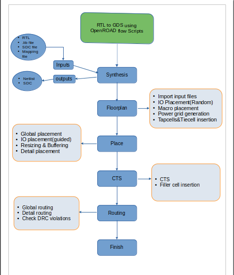
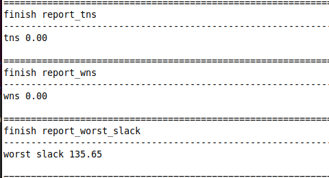

# asap7_contest


# PPA Improvement of ibex using OpenROAD Flow Scripts

# Tool Flow of OpenROAD Flow Scripts:




#
# Design Name: Ibex


# Steps followed:


1.In Ubuntu22.04 followed following instruction to build and install: 
```
sudo apt update && sudo apt-get upgrade
git clone --recursive https://github.com/The-OpenROAD-Project/OpenROAD-flow-scripts
cd OpenROAD-flow-scripts
sudo ./setup.sh
./build_openroad.sh
```
ORFS specific package installer step may vary wrt., above instructions. Always refer to this [document](https://openroad-flow-scripts.readthedocs.io/en/latest/user/BuildLocally.html) for latest installation steps to follow.

Then run below steps:
```
source setup_env.sh
cd flow
```

2.Comment the default design to be executed from `Makefile` and un-comment `DESIGN_CONFIG=./designs/asap7/ibex/config.mk`.


3.Run following steps manually:

```
make synth
make floorplan
```

4.Check the timing report and choose path group to set as false path. Update `2_floorplan.sdc` and continue to `placement` stage.

```
make place
make cts
make route
make finish
```

If you check each stage timing report from placement stage those un-constrained paths are removed from the OpenSTA logs.

#
# Make changes :

In `constraint.sdc` file, I've changed the clk io percentage into `0.15` ie., `set clk_io_pct 0.15` to reduce input/output delay value to meet timing violations and fix the slack.

In `2_floorplan.sdc` file has been updated the false path to clear the unconstrained paths and endpoints which are `TIELO*`, async path group which is connected reset pins `rst_ni`. 

```
#set_input_delay 352.0000 -clock [get_clocks {core_clock}] -add_delay [get_ports {rst_ni}]
set_false_path -from [get_ports {rst_ni}]

#set_output_delay 352.0000 -clock [get_clocks {core_clock}] -add_delay [get_ports {alert_major_o}]
set_false_path -to [get_ports {alert_major_o}]
#set_output_delay 352.0000 -clock [get_clocks {core_clock}] -add_delay [get_ports {alert_minor_o}]
set_false_path -to [get_ports {alert_minor_o}]

#set_output_delay 352.0000 -clock [get_clocks {core_clock}] -add_delay [get_ports {data_addr_o[0]}]
set_false_path -to [get_ports {data_addr_o[0]}]
#set_output_delay 352.0000 -clock [get_clocks {core_clock}] -add_delay [get_ports {data_addr_o[1]}]
set_false_path -to [get_ports {data_addr_o[1]}]
#set_output_delay 352.0000 -clock [get_clocks {core_clock}] -add_delay [get_ports {instr_addr_o[0]}]
set_false_path -to [get_ports {instr_addr_o[0]}]
#set_output_delay 352.0000 -clock [get_clocks {core_clock}] -add_delay [get_ports {instr_addr_o[1]}]
set_false_path -to [get_ports {instr_addr_o[1]}]

set_false_path -from [get_pins _36182_/CLK]
set_false_path -from [get_pins _36313_/CLK]
```

In `CTS` stage I've updated CTS buffer list in `designs/asap7/ibex/config.mk` file in our design to improve the timing from default value taken from `platforms/asap7/config.mk`

```
export CTS_BUF_CELL  = BUFx8_ASAP7_75t_R
```

So with all the above mentioned changes I'm able to meet TNS/WNS value as `0` from negative slack value.


#
# Final report:

# Before changes:


# After changes:




