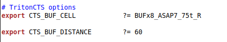
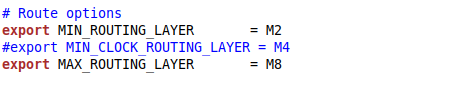
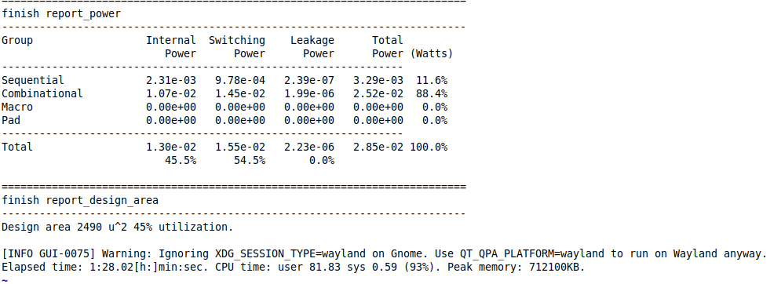

# asap7_contest


# PPA Improvement of ibex using OpenROAD Flow Scripts

# Tool Flow of OpenROAD Flow Scripts:


#
# Design Name: Ibex


# Steps followed:


1.Build and install using `./build_openroad.sh`

2.Comment the ibex/config.mk in the makefile at OpenROAD-flow-scripts/flow folder


3.Run `make` 

4.Note the timings from the logs

5.Repeat from Step 1 again

#
# Challenges :

1. Finding proper pin placement.

2. Maintain proper cluster size and diameter to gain best clock skew.

3. Finding the appropriate buffer or clock inverter cell for the better timing.

4. High routing congestion while increasing the clock ferquency.

5. Distributing the metal later property for clock tree, signal net and pin to get better PPA without zero -ve skew.

6. Adjust the global routing layer properly to minimize routing congestion.

7. Keep the design DRC free while increasing the clock frequency.


#
# Observation :

1. In the library file there wasn't any clock buffer cell so we had to use the normal buffer cell and clock inverter.

2. While increasing the clock frequency we observe some DRC violations at routing stage.


#
# Changes done in design :

`Floorplan:`

Set unconstraints paths into false path.

`CTS:`

Changed the CTS cell.
Defining clock routing layer.

`Route:`

Adjust the global routing layer.
Changing the metal routing layer.


#
# Make changes :
In `floorplan.sdc` file we updated the false path to clear the unconstrainrd paths and endpoints which are `TIE` low cells.
```
#set_input_delay 352.0000 -clock [get_clocks {core_clock}] -add_delay [get_ports {rst_ni}]
set_false_path -from [get_ports {rst_ni}]

#set_output_delay 352.0000 -clock [get_clocks {core_clock}] -add_delay [get_ports {alert_major_o}]
set_false_path -to [get_ports {alert_major_o}]
#set_output_delay 352.0000 -clock [get_clocks {core_clock}] -add_delay [get_ports {alert_minor_o}]
set_false_path -to [get_ports {alert_minor_o}]

#set_output_delay 352.0000 -clock [get_clocks {core_clock}] -add_delay [get_ports {data_addr_o[0]}]
set_false_path -to [get_ports {data_addr_o[0]}]
#set_output_delay 352.0000 -clock [get_clocks {core_clock}] -add_delay [get_ports {data_addr_o[1]}]
set_false_path -to [get_ports {data_addr_o[1]}]
#set_output_delay 352.0000 -clock [get_clocks {core_clock}] -add_delay [get_ports {instr_addr_o[0]}]
set_false_path -to [get_ports {instr_addr_o[0]}]
#set_output_delay 352.0000 -clock [get_clocks {core_clock}] -add_delay [get_ports {instr_addr_o[1]}]
set_false_path -to [get_ports {instr_addr_o[1]}]

set_false_path -from [get_pins _36182_/CLK]
set_false_path -from [get_pins _36313_/CLK]
```

In `cts` stage we changed the clock routing layer and CTS cell list for our design to improve the timing and also changed the diameter to improve the clock skew.



In `route` we modified the global routing layer adjustment attribute in our design to get the better PPA and modify the routing layer to use the metal layer prperly for signal routing.




#
# Final report:

# Before changes:





# After changes:


